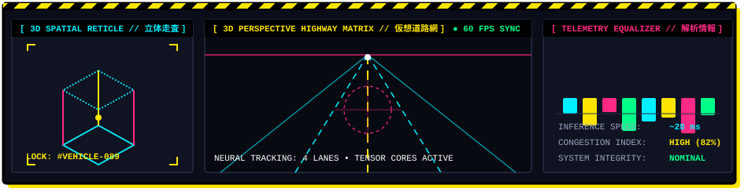
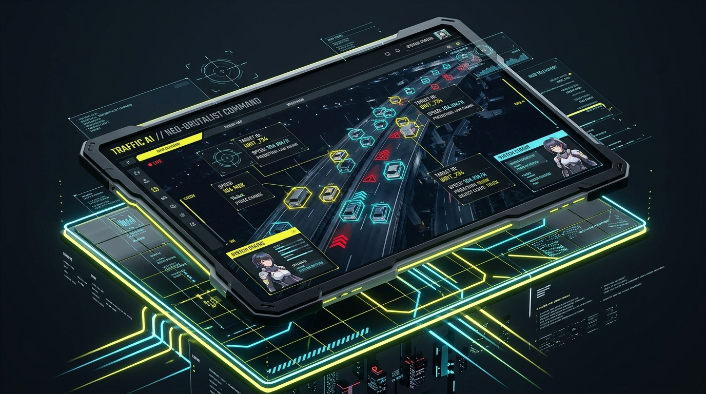



  

<!-- HERO CYBER-ANIME BANNER -->

  

<!-- ANIMATED TYPING HEADER -->

  

<!-- LIVE ANIMATED STATUS HUD -->

  

<!-- HIGH VOLTAGE BADGES -->

  
  
  
  
  
  

---

`
/// WARNING: 3D CYBERNETIC VISION PROTOCOL ENGAGED ///////////////////////////////////
/// [NODE 084: NEO-TOKYO EXPRESSWAY MATRIX] // SYSTEM OPERATIONAL // CREDITS: 50 /////
/////////////////////////////////////////////////////////////////////////////////////
`

## ⚡ 01 // 3D HOLOGRAPHIC RADAR & TELEMETRY HUB (立体電脳網)

  

**Traffic-AI** combines cutting-edge **YOLOv11 Computer Vision** with a pulse-pounding **3D Neo-Brutalist × Cyber-Anime** control console. Designed for autonomous highway surveillance, urban command stations, and intelligent traffic telemetry.

### 🌐 Live Deployment Telemetry
* **Cloud Node Web GUI:** http://65.2.194.60/analysis.html (Port 80 Unified Gateway)
* **API Gateway Health:** http://65.2.194.60/api/health (Port 80 via Nginx Reverse Proxy)
* **Cloud Architecture:** AWS EC2 Ubuntu 22.04 LTS + Nginx Reverse Proxy (Port 80 ➔ Port 8000)

---

## 🎮 02 // 3D COMMAND CONSOLE & INTERFACE SHOWCASE (3D立体司令端末)

  
<b>[ 3D ISOMETRIC NEURAL COMMAND TABLET // 立体ホログラム端末 ]</b>

  
    
  <em>⚡ Angled 3D Isometric Perspective • Holographic Targeting Reticles • High-Voltage Cyber Circuit Grid</em>

 

  
<b>[ LIVE ANALYZER BAY // 視覚解析ステーション ]</b>

  
    
  <em>⚡ Full Neo-Brutalist HUD • Real-time Canvas Reticle Detection • Multi-Agent Telemetry Breakdown</em>

---

## 🔥 03 // CORE ARSENAL & CAPABILITIES (主要機能)

<table>
  <thead>
    <tr>
      <th align="center">PROTOCOL</th>
      <th>FEATURE MODULE</th>
      <th>SPECIFICATION DETAILS</th>
    </tr>
  </thead>
  <tbody>
    <tr>
      <td align="center"><code>[ PHASE 01 ]</code></td>
      <td><b>⚡ YOLOv11 Reticle Detection</b></td>
      <td>Single-pass neural tensor inference under <b>35ms</b>. Draws sharp bounding reticles, lock-on corner brackets, and classification confidence scores directly on HTML5 Canvas.</td>
    </tr>
    <tr>
      <td align="center"><code>[ PHASE 02 ]</code></td>
      <td><b>🚗 Multi-Class Traffic Telemetry</b></td>
      <td>Real-time tracking and telemetry tallying across <b>Cars (車両)</b>, <b>Bikes / Motorbikes (二輪車)</b>, and <b>Pedestrians (歩行者)</b> with individual mecha counter panels.</td>
    </tr>
    <tr>
      <td align="center"><code>[ PHASE 03 ]</code></td>
      <td><b>📊 Real-Time Congestion Index</b></td>
      <td>Dynamic saturation metering engine: evaluates vehicle density in real-time to trigger <b>[ LOW // 軽度 ]</b>, <b>[ MED // 注意 ]</b>, or <b>[ HIGH // 警戒 ]</b> alerts.</td>
    </tr>
    <tr>
      <td align="center"><code>[ PHASE 04 ]</code></td>
      <td><b>💾 Flight Recorder Log Archive</b></td>
      <td>Every scan is recorded into an immutable audit table with timestamping, breakdown totals, status pills, search filtering, and instant log wipe controls.</td>
    </tr>
    <tr>
      <td align="center"><code>[ PHASE 05 ]</code></td>
      <td><b>🎨 3D Neo-Brutalist × Cyber-Anime UI</b></td>
      <td>Stark <b>black ink borders</b>, hard drop shadows with zero blur, electric cyberpunk palette (<code>#FFE600</code>, <code>#FF2A85</code>, <code>#00F0FF</code>), Japanese Kanji subtitles, and tactile spring button animations.</td>
    </tr>
  </tbody>
</table>

---

## 🏛️ 04 // ANIMATED 3D DATA FLOW & ARCHITECTURE (立体システム構成)

  

`mermaid
flowchart LR
    subgraph CLIENT["⚡ FRONTEND HUD (CLIENT BROWSER)"]
        UI["Neo-Brutalist UI (HTML5 / Vanilla CSS)"]
        Canvas["Vision Canvas (Reticle Bounding Boxes)"]
        State["LocalStorage State (Daily Credits: 50)"]
    end

    subgraph AWS["☁️ AWS EC2 PRODUCTION NODE (65.2.194.60)"]
        Nginx["Nginx Web Gateway (Port 80 HTTP)"]
        Uvicorn["Uvicorn ASGI Server (127.0.0.1:8000)"]
        FastAPI["FastAPI App Engine (backend/main.py)"]
        YOLO["YOLOv11 Neural Core (yolo11n.pt PyTorch)"]
    end

    UI -->|"1. Image Upload (POST /api/analyze)"| Nginx
    Nginx -->|"Proxy Pass /api/"| Uvicorn
    Uvicorn --> FastAPI
    FastAPI -->|"Inference Tensor"| YOLO
    YOLO -->|"Telemetry JSON (Boxes, Classes, Counts)"| FastAPI
    FastAPI -->|"Response Payload"| Nginx
    Nginx -->|"JSON Stream"| UI
    UI --> Canvas
    UI --> State
`

---

## 🛠️ 05 // SYSTEM SPECS & TECH MATRIX (技術仕様)

| Dimension | Specification | Notes |
| :--- | :--- | :--- |
| **Vision Model** | Ultralytics YOLOv11 Nano (yolo11n.pt) | Auto-downloads weights if missing on server |
| **Backend Framework** | FastAPI 0.110+ + Uvicorn ASGI | Python 3.10+ asynchronous event loop |
| **Frontend Framework**| Vanilla HTML5 + Custom CSS3 + ES6+ | Ultra-fast with zero heavyweight framework bloat |
| **Design System** | 3D Neo-Brutalism × Cyberpunk Anime | High-contrast black borders & flat offset shadows |
| **Typography** | Outfit, Space Grotesk, JetBrains Mono, Noto Sans JP | Loaded via Google Fonts API |
| **Cloud Hosting** | Amazon Web Services (AWS) EC2 | Ubuntu Server 22.04 LTS Node |
| **Web Server** | Nginx (Reverse Proxy on Port 80) | Proxies /api/ to 127.0.0.1:8000 |

---

## 🚀 06 // QUICK START GUIDE (起動手順)

### A. Local Machine Setup

`ash
# 1. Clone this repository
git clone https://github.com/sivanandan21/traffic-ai.git
cd traffic-ai

# 2. Setup virtual environment
python -m venv venv

# Windows activate:
.\venv\Scripts\activate

# Linux / Mac activate:
source venv/bin/activate

# 3. Install core dependencies
pip install -r requirements.txt

# 4. Launch FastAPI Backend
uvicorn backend.main:app --host 0.0.0.0 --port 8000 --reload

# 5. Open Frontend
# Open index.html in your browser or launch VS Code Live Server on port 5500
`

---

### B. AWS EC2 Cloud Deployment Guide (Unified Nginx Port 80 Gateway)

`ash
# 1. SSH into your EC2 instance via MobaXterm / Terminal
ssh -i "your-key.pem" ubuntu@YOUR_EC2_PUBLIC_IP

# 2. Clone & navigate to repo
git clone https://github.com/sivanandan21/traffic-ai.git
cd traffic-ai/backend

# 3. Activate venv & install dependencies
python3 -m venv venv
source venv/bin/activate
pip install -r ../requirements.txt

# 4. Run FastAPI backend in background on local loopback (port 8000)
nohup uvicorn main:app --host 127.0.0.1 --port 8000 > uvicorn.log 2>&1 &

# 5. Copy frontend static assets to web root
sudo cp -r ~/traffic-ai/*.html ~/traffic-ai/*.css ~/traffic-ai/*.js /var/www/html/
`

#### 6. Configure Nginx Reverse Proxy (/etc/nginx/sites-available/default)

`
ginx
server {
    listen 80 default_server;
    listen [::]:80 default_server;

    root /var/www/html;
    index index.html;

    server_name _;

    # Frontend Web GUI
    location / {
        try_files  / =404;
    }

    # Reverse Proxy /api/ to FastAPI Backend on port 8000
    location /api/ {
        proxy_pass http://127.0.0.1:8000/api/;
        proxy_set_header Host System.Management.Automation.Internal.Host.InternalHost;
        proxy_set_header X-Real-IP ;
        proxy_set_header X-Forwarded-For ;
        client_max_body_size 20M;
    }
}
`

`ash
# Test & restart Nginx
sudo nginx -t
sudo systemctl restart nginx
`

> 🛡️ **SECURITY & NETWORK ADVANTAGE:**  
> By using Nginx as a reverse proxy on **Port 80**, you only need to allow **Port 80 (HTTP)** in your AWS Security Group. Port 8000 stays closed to the public internet (127.0.0.1), preventing external attacks and completely eliminating browser CORS issues.

---

## 📡 07 // REST API REFERENCE (API仕様)

### 1. System Health Check
* **Endpoint:** GET /api/health
* **Response:**
`json
{
  "status": "ok"
}
`

### 2. Neural Image Analysis
* **Endpoint:** POST /api/analyze
* **Payload:** multipart/form-data with key ile (JPG, PNG, WEBP)
* **Response Payload:**
`json
{
  "cars": 5,
  "bikes": 2,
  "people": 3,
  "total": 10,
  "traffic_level": "MEDIUM",
  "detections": [
    {
      "class": "car",
      "confidence": 0.91,
      "box": [120, 85, 340, 210]
    }
  ]
}
`

---

## 🎮 08 // KEYBOARD & HUD SHORTCUTS

| Shortcut | Action | Scope |
| :---: | :--- | :--- |
| Ctrl + Shift + R | **Hard Refresh / Purge Style Cache** | Browser Web GUI |
| Space | **Trigger Analysis** (when image loaded) | Analyzer Bay |
| Esc | **Clear Canvas & Reset Reticles** | Analyzer Bay |
| F12 | **Inspect Telemetry JSON Payload** | Browser DevTools |

---

## 📜 09 // LICENSE & MISSION DOSSIER

Distributed under the **MIT License**. Created by [sivanandan21](https://github.com/sivanandan21).  
Crafted with passion for AI, Computer Vision, Neo-Brutalist Architecture, and Anime Cyber Aesthetics.

  

  <b>3D NEO-BRUTALIST VISION ENGINE • TRAFFIC-AI © 2026 • ALL RIGHTS RESERVED</b>

