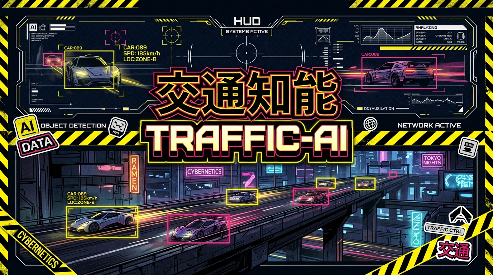
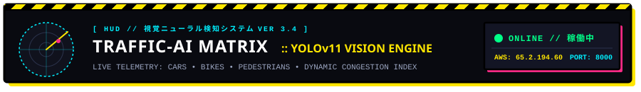
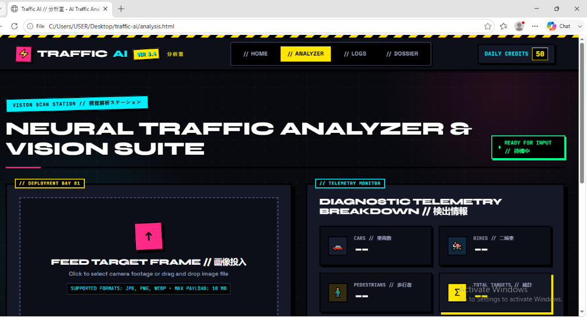
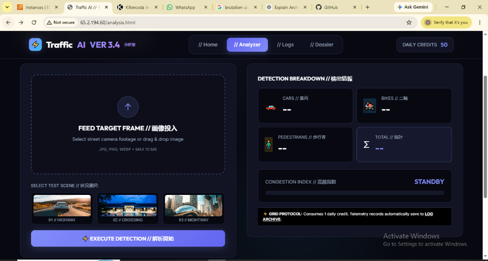



  

  

  

  

  
  
  
  
  
  

---

`
/// WARNING: CYBERNETIC VISION PROTOCOL ONLINE ///////////////////////////////////////
/// [NODE 084: TOKYO EXPRESSWAY MATRIX] // SYSTEM OPERATIONAL // DAILY CREDITS: 50 ///
/////////////////////////////////////////////////////////////////////////////////////
`

## ⚡ 01 // SYSTEM BRIEFING (概要)

**Traffic-AI** is a futuristic, state-of-the-art visual intelligence and traffic telemetry platform designed with a high-octane **Neo-Brutalist × Cyber-Anime** aesthetic.

Engineered for city planners, surveillance hubs, and autonomous traffic command centers, the system couples the ultralight **Ultralytics YOLOv11** neural network with an asynchronous **FastAPI** backend and an electric HUD frontend featuring tactile spring physics, solid ink drop shadows, warning hazard stripes, and targeting canvas reticles.

### 🌐 Live Deployment Telemetry
* **Cloud Node Host:** http://65.2.194.60/analysis.html
* **API Gateway Health:** http://65.2.194.60:8000/api/health
* **Target Architecture:** AWS EC2 Ubuntu Linux Node + Nginx Reverse Proxy

---

## 📸 02 // MISSION INTERFACE PREVIEW (視覚スクリーンショット)

  <table>
    <tr>
      <td width="50%" align="center">
        <b>[ ANALYSIS BAY // 画像投入ステーション ]</b>  
        
         
        <em>Interactive Canvas Reticles • Drag & Drop Feed • Real-time Stats</em>
      </td>
      <td width="50%" align="center">
        <b>[ AWS CLOUD NODE // 稼働中ライブ環境 ]</b>  
        
         
        <em>Deployed on AWS EC2 • Automated Daily Credit Matrix • Nginx Gateway</em>
      </td>
    </tr>
  </table>

---

## 🔥 03 // CORE ARSENAL & CAPABILITIES (主要機能)

<table>
  <thead>
    <tr>
      <th align="center">PROTOCOL</th>
      <th>FEATURE MODULE</th>
      <th>SPECIFICATION DETAILS</th>
    </tr>
  </thead>
  <tbody>
    <tr>
      <td align="center"><code>[ PHASE 01 ]</code></td>
      <td><b>⚡ YOLOv11 Reticle Detection</b></td>
      <td>State-of-the-art vision weights with single-pass inference under <b>35ms</b>. Automatically renders sharp bounding boxes, confidence percentages, and crosshair reticles directly on the HTML5 Canvas.</td>
    </tr>
    <tr>
      <td align="center"><code>[ PHASE 02 ]</code></td>
      <td><b>🚗 Multi-Class Traffic Telemetry</b></td>
      <td>Accurately isolates, tracks, and tallies individual traffic classes: <b>Cars (車両)</b>, <b>Bikes / Motorbikes (二輪車)</b>, and <b>Pedestrians (歩行者)</b> with aggregate summaries.</td>
    </tr>
    <tr>
      <td align="center"><code>[ PHASE 03 ]</code></td>
      <td><b>📊 Real-Time Congestion Index</b></td>
      <td>Dynamic congestion engine that calculates road saturation levels in real-time: <b>[ LOW // 軽度 ]</b>, <b>[ MED // 注意 ]</b>, or <b>[ HIGH // 警戒 ]</b>.</td>
    </tr>
    <tr>
      <td align="center"><code>[ PHASE 04 ]</code></td>
      <td><b>💾 Flight Recorder Archive</b></td>
      <td>Every scan is logged locally and remotely into an immutable audit table with timestamping, breakdown totals, status pills, search filtering, and log wipe controls.</td>
    </tr>
    <tr>
      <td align="center"><code>[ PHASE 05 ]</code></td>
      <td><b>🎨 Neo-Brutalist × Cyber-Anime UI</b></td>
      <td>Solid <b>black ink borders</b>, hard drop shadows with zero blur, electric cyberpunk palette (<code>#FFE600</code>, <code>#FF2A85</code>, <code>#00F0FF</code>), Japanese Kanji subtitles, and tactile spring button animations.</td>
    </tr>
  </tbody>
</table>

---

## 🏛️ 04 // SYSTEM ARCHITECTURE MATRIX (システム構成)

`mermaid
flowchart LR
    subgraph CLIENT["⚡ FRONTEND HUD (CLIENT BROWSER)"]
        UI["Neo-Brutalist UI (HTML5 / Vanilla CSS)"]
        Canvas["Vision Canvas (Reticle Bounding Boxes)"]
        State["LocalStorage State (Daily Credits: 50)"]
    end

    subgraph AWS["☁️ AWS EC2 PRODUCTION NODE (65.2.194.60)"]
        Nginx["Nginx Web Gateway (Port 80 HTTP)"]
        Uvicorn["Uvicorn ASGI Server (Port 8000)"]
        FastAPI["FastAPI App Engine (backend/main.py)"]
        YOLO["YOLOv11 Neural Core (yolo11n.pt PyTorch)"]
    end

    UI -->|"1. Image Upload (POST /api/analyze)"| Nginx
    Nginx -->|"Proxy Pass"| Uvicorn
    Uvicorn --> FastAPI
    FastAPI -->|"Inference Tensor"| YOLO
    YOLO -->|"Telemetry JSON (Boxes, Classes, Counts)"| FastAPI
    FastAPI -->|"Response Payload"| Nginx
    Nginx -->|"JSON Stream"| UI
    UI --> Canvas
    UI --> State
`

---

## 🛠️ 05 // SYSTEM SPECS & TECH MATRIX (技術仕様)

| Dimension | Specification | Notes |
| :--- | :--- | :--- |
| **Vision Model** | Ultralytics YOLOv11 Nano (yolo11n.pt) | Auto-downloaded fallback if missing |
| **Backend Framework** | FastAPI 0.110+ + Uvicorn ASGI | Python 3.10+ async pipeline |
| **Frontend Framework**| Vanilla HTML5 + Custom CSS3 + ES6+ | Zero heavyweight framework dependencies |
| **Design System** | Neo-Brutalism × Cyberpunk Anime | High-contrast black borders & flat offset shadows |
| **Typography** | Outfit, Space Grotesk, JetBrains Mono, Noto Sans JP | Loaded via Google Fonts API |
| **Cloud Hosting** | Amazon Web Services (AWS) EC2 | Ubuntu Server 22.04 LTS |
| **Web Server** | Nginx (Reverse Proxy) + systemd/nohup | Automated port 80 to 8000 routing |

---

## 🚀 06 // QUICK START GUIDE (起動手順)

### A. Local Machine Setup

`ash
# 1. Clone this repository
git clone https://github.com/sivanandan21/traffic-ai.git
cd traffic-ai

# 2. Setup virtual environment
python -m venv venv

# Windows activate:
.\venv\Scripts\activate

# Linux / Mac activate:
source venv/bin/activate

# 3. Install core dependencies
pip install -r requirements.txt

# 4. Launch FastAPI Backend
uvicorn backend.main:app --host 0.0.0.0 --port 8000 --reload

# 5. Open Frontend
# Open index.html in your browser or launch VS Code Live Server on port 5500
`

---

### B. AWS EC2 Cloud Deployment Guide

`ash
# 1. SSH into your EC2 instance via MobaXterm / Terminal
ssh -i "your-key.pem" ubuntu@YOUR_EC2_PUBLIC_IP

# 2. Clone & navigate to repo
git clone https://github.com/sivanandan21/traffic-ai.git
cd traffic-ai/backend

# 3. Activate venv & install requirements
python3 -m venv venv
source venv/bin/activate
pip install -r ../requirements.txt

# 4. Run backend permanently in background
nohup uvicorn main:app --host 0.0.0.0 --port 8000 > uvicorn.log 2>&1 &

# 5. Serve frontend with Nginx
sudo cp -r ~/traffic-ai/*.html ~/traffic-ai/*.css ~/traffic-ai/*.js /var/www/html/
`

> **IMPORTANT AWS SECURITY GROUP NOTE:**  
> Ensure your EC2 Security Group allows Inbound Traffic for:
> * **Port 80 (HTTP)** — Frontend Web GUI
> * **Port 8000 (Custom TCP)** — FastAPI Backend (if calling directly)

---

## 📡 07 // REST API REFERENCE (API仕様)

### 1. System Health Check
* **Endpoint:** GET /api/health
* **Response:**
`json
{
  "status": "ok"
}
`

### 2. Neural Image Analysis
* **Endpoint:** POST /api/analyze
* **Payload:** multipart/form-data with key ile (JPG, PNG, WEBP)
* **Response Payload:**
`json
{
  "cars": 5,
  "bikes": 2,
  "people": 3,
  "total": 10,
  "traffic_level": "MEDIUM",
  "detections": [
    {
      "class": "car",
      "confidence": 0.91,
      "box": [120, 85, 340, 210]
    }
  ]
}
`

---

## 🎮 08 // KEYBOARD & HUD SHORTCUTS

| Shortcut | Action | Scope |
| :---: | :--- | :--- |
| Ctrl + Shift + R | **Hard Refresh / Purge Style Cache** | Browser Web GUI |
| Space | **Trigger Analysis** (when image loaded) | Analyzer Bay |
| Esc | **Clear Canvas & Reset Reticles** | Analyzer Bay |
| F12 | **Inspect Telemetry JSON Payload** | Browser DevTools |

---

## 📜 09 // LICENSE & MISSION DOSSIER

Distributed under the **MIT License**. Created by [sivanandan21](https://github.com/sivanandan21).  
Crafted with passion for AI, Computer Vision, Neo-Brutalist Architecture, and Anime Cyber Aesthetics.

  

  <b>NEO-BRUTALIST VISION ENGINE • TRAFFIC-AI © 2026 • ALL RIGHTS RESERVED</b>

